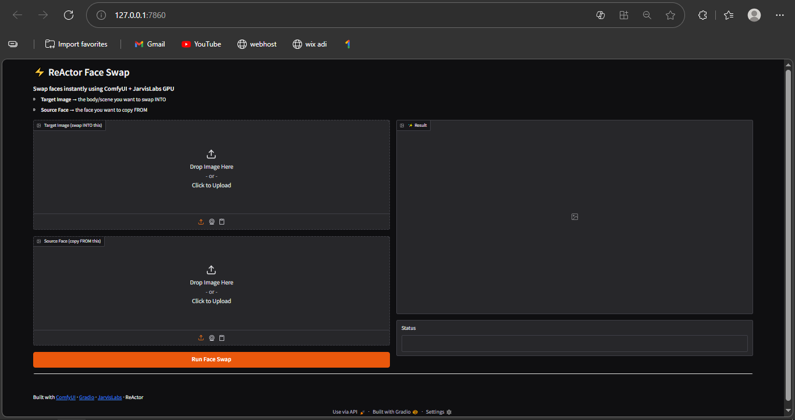

# ⚡ ReActor Face Swap Web App

> Swap any face onto any image — straight from your browser. No Photoshop. No manual editing. Just upload and click.



---

## 🎬 Demo

| Target Image | Source Face | Output |
|-------------|-------------|--------|
|  |  |  |

---

## 🚀 What Is This?

A web application that runs **ReActor face swap** directly from your browser — powered by a **ComfyUI workflow** running on a **JarvisLabs GPU** in the background.

Upload a **target image** (the scene to swap INTO) and a **source face** (the face to copy FROM), hit Run, and get your result in seconds.

No third party apps. No cloud subscriptions. You own the entire pipeline.

---

## 🛠️ Tech Stack

| Layer | Tool |
|-------|------|
| 🎨 Frontend | [Gradio](https://gradio.app) |
| ⚙️ Workflow Engine | [ComfyUI](https://github.com/comfyanonymous/ComfyUI) |
| 🔄 Face Swap | [ReActor Node](https://github.com/Gourieff/comfyui-reactor-node) |
| 🚀 GPU Backend | [JarvisLabs](https://jarvislabs.ai) |
| 🐍 Language | Python |

---

## 📁 Project Structure

```
reactor-faceswap-webapp/
├── app.py                  # Gradio web UI
├── comfyui_client.py       # ComfyUI API client
├── requirements.txt        # Python dependencies
├── .gitignore
└── workflows/
    ├── __init__.py
    └── face_swap.py        # ReActor workflow + node mapping
```

---

## ⚙️ How It Works

```
Browser (Gradio UI)
      ↓  upload images
ComfyUI API (JarvisLabs GPU)
      ↓  run ReActor workflow
      ↓  face detected + swapped
Output image returned to browser
```

1. User uploads **target image** and **source face** via Gradio UI
2. Both images are sent to ComfyUI running on JarvisLabs GPU
3. ReActor detects and swaps the face
4. Output image is returned and displayed instantly

---

## 🔧 Setup & Installation

### Prerequisites
- Python 3.10+
- A running ComfyUI instance (local or JarvisLabs)
- ReActor node installed in ComfyUI
- `inswapper_128.onnx` model in ComfyUI models folder

### 1. Clone the repo
```bash
git clone https://github.com/yourusername/reactor-faceswap-webapp.git
cd reactor-faceswap-webapp
```

### 2. Create a virtual environment
```bash
python -m venv venv

# Windows
venv\Scripts\activate

# Mac/Linux
source venv/bin/activate
```

### 3. Install dependencies
```bash
pip install -r requirements.txt
```

### 4. Set your ComfyUI URL
Open `app.py` and update this line with your ComfyUI instance URL:
```python
COMFYUI_URL = "https://your-comfyui-instance-url"
```

### 5. Run the app
```bash
python app.py
```

Open `http://localhost:7860` in your browser. 🎉

---

## 🖥️ ComfyUI Workflow Node Map

| Node | ID | Role |
|------|----|------|
| LoadImage | 2 | Target image — swap INTO this |
| LoadImage | 3 | Source face — copy FROM this |
| ReActorFaceSwap | 1 | Performs the face swap |
| SaveImage | 4 | Returns the output |

---

## 📦 Requirements

```
gradio>=4.0.0
requests>=2.31.0
Pillow>=10.0.0
```

---

## 🗺️ Roadmap

- [x] ReActor face swap workflow
- [ ] Jewelry model photoshoot (FLUX Pro / Dev / Schnell)
- [ ] Video face swap support
- [ ] Multiple faces swap in one image
- [ ] Hugging Face Spaces deployment

---

## 🤝 Contributing

Pull requests are welcome! If you find a bug or want to add a new ComfyUI workflow:

1. Fork the repo
2. Create a new branch `git checkout -b feature/your-feature`
3. Commit your changes `git commit -m "feat: your feature"`
4. Push and open a Pull Request

---

## ⚠️ Disclaimer

This project is intended for **creative and educational purposes only**.
Please use responsibly and respect people's privacy and consent.

---

## 📄 License

MIT License — free to use, modify and distribute.

---

⭐ **If this project helped you, consider giving it a star!** It helps others discover it.